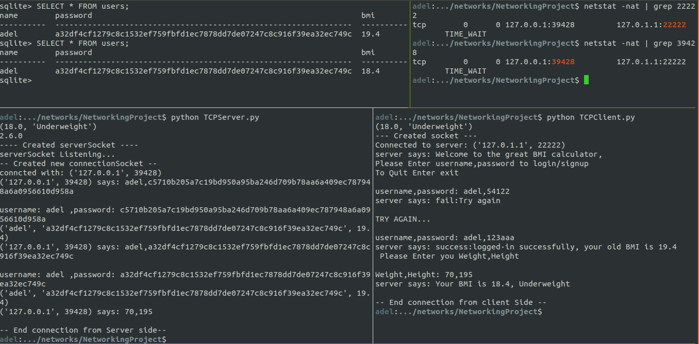
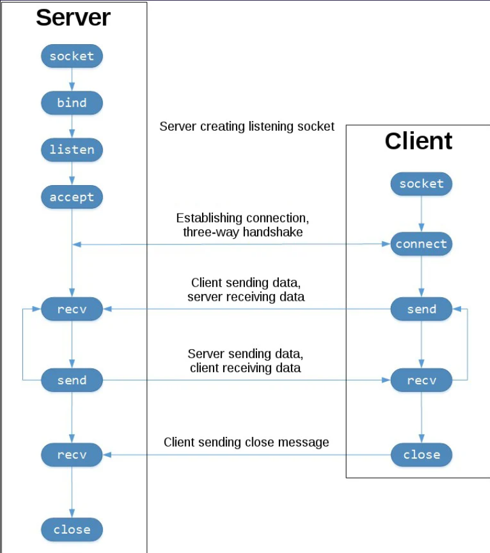

# Server-Client BMI calculator App 

## Screen Shot of the app in action showing the database content and the socket states after the session is completed

## features and techs used
1. socket programming (TCP)
2. sqllite for database management
3. simple user account logging and password storage security 
   
## Sequence of Sockets Communication
