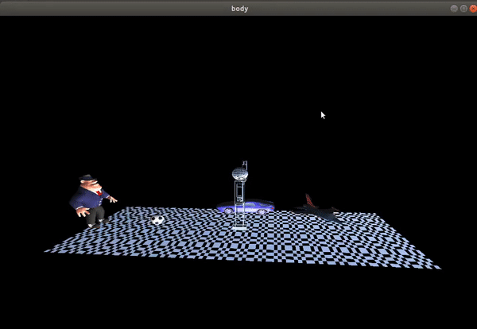

# graphics-final-project
# SBE306B_Spring20_Project_Group_04

## Team Members:
- Name : Adel Refat Ali | Sec : 2 | Seat No.: 3 | Email: adel.elmala2025@gmail.com
- Name : Ahmed Nabil Salem | Sec: 1 | Seat No.: 10 | Email: ahmednaza7@gmail.com
- Name : Mahmoud Abdel Monem | Sec: 2  | Seat No.: 26 | Email:  hooodamonem111@gmail.com
- Name : Ahmed Osama Mohamed| Sec: 1 | Seat No.: 2 | Email: ahmedosamam.negm@gmail.com
- Name : Shaden Ahmed | Sec: 1 | Seat No.: 44 | Email: shaden.ahmedbaki@gmail.com

## Implementation:
### Final result 
<!--  -->

## Loaded objects 
### object 1
<!--  -->
<!--  -->

### object 2
<!-- 
 -->

### object 3
<!--  -->

`
### object 4
<!--  -->
<!--  -->

## animations

### Robot wave
<!--  -->

### Robot play soccer
<!--  -->

### Car Movement
<!--  -->

### Plane Movement
<!--  -->

## Texture Mapping
### View 1 
<!--  -->

### View 2
<!--  -->

## Issues 

### Texture Mapping
- not any images can be mapped and still look nice , it has to be cropped to it's smallest element to look better.
### Lighting 
- had to figure out where to position the light source in respect to the floor to be illuminated properly.

## Idea of the animations
<!-- - The idea came to me when i was looking from my window down the street. -->
<!-- - I call it "el3ab b3eed ya 7mada bdl m2t3 elkora". -->
1. the 'car' moves along the z axis of the floor and turns around every time it reaches the edge
2. the 'plane' spin around it's Y axis 
3. the 'Robot' waves his BOTH hands
4. the 'Robot' moves his leg to kick the ball and the ball bounces every time it reaches either the 'robor' or 'al Capone'.  

## Conclusion
 - the scene is controlled from the menu, you can gradually choose objects to start moving.
 - Beside the animations controls,  you can choose the texture mapping of the floor from the same menu.

## Use in biomedical field
- it can be used to import objects constructed from several scans like mri or other imaging machines, then the user can view it in 3d scene for better view , looking to it from different angles and positions.

## Controls
### Robot controls

<!-- | Robot        | key           | controls  || -->
<!-- | ------------- |:-------------:| -----:| -----:| -->
| **Body Part**   | **key**    | **Body Part**     |**key**|
| :-------------:   |:----------:| :-----------------:| :-----:|
| Left Arm        | z - Z      |  Right Arm        | a - A |
|  Left Shoulder  | x - X      |   Right Shoulder  | s - S |
|  Left Elbow     |   d - D    |   Right Elbow     | e - E |
|Left Hip         | y -Y       |Right Hip          | h - H |
|Left leg         | o - O      |Right leg          |l -L   |
|Left Knee        |i - I       |Right Knee         |k - K  |
|Left Base        |f - F       |Right Base         |f - F  |
|Left Flang       |v - V       |Right Flang        |v - V  |

### Camera controls
|Action|Key |Action|key|
|:-----:|-----:|:-----:|-----:|
|Zoom In |B|Zoom out|b|
|left| <-- OR mouse|Right| --> OR mouse|
|Down|down-arrow|UP|up-arrow|

### Animation Controls
**_Left Click and Choose_**

### Compile 

`g++ -o out SBE306B_Spring20_Project_Group_04.cpp ./srcs/imageloader.cpp ./srcs/glm.cpp -lGL -lglut -lGLU -lm`
### Run 

`./out`
