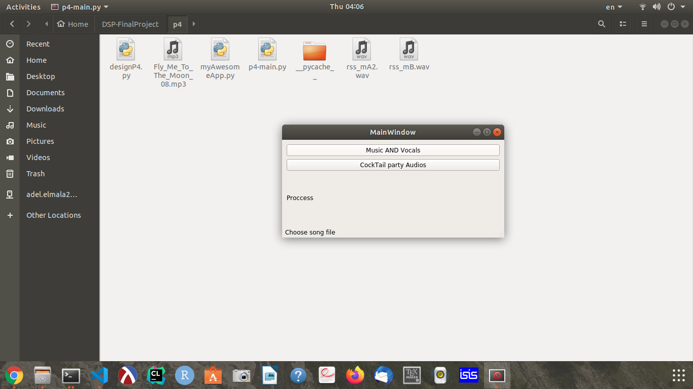
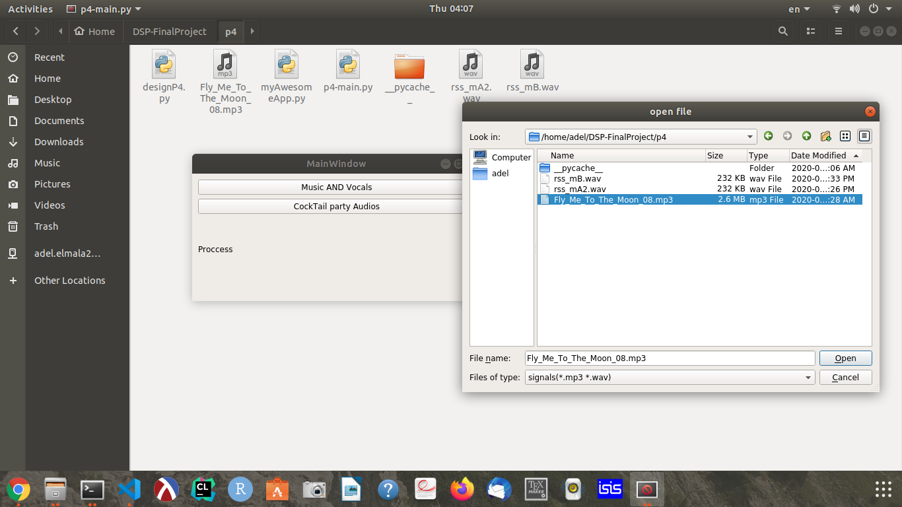
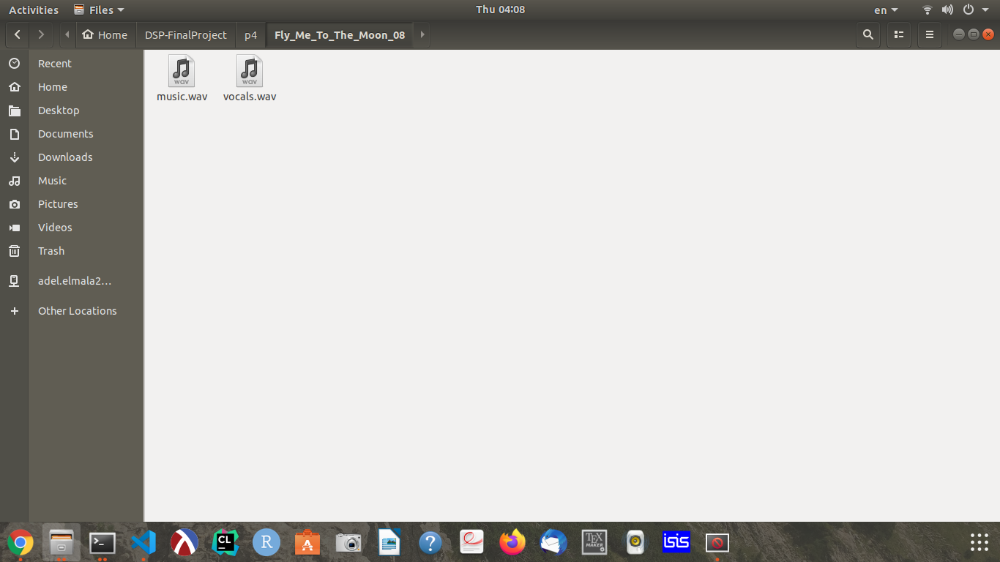
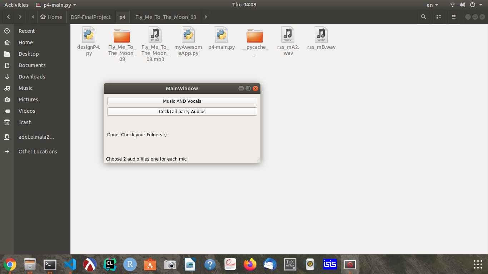
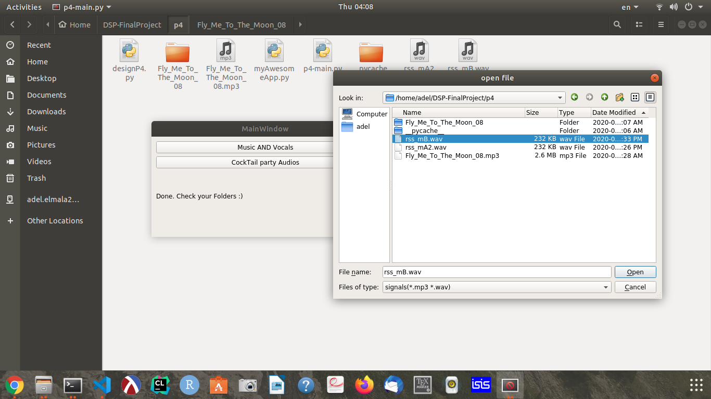
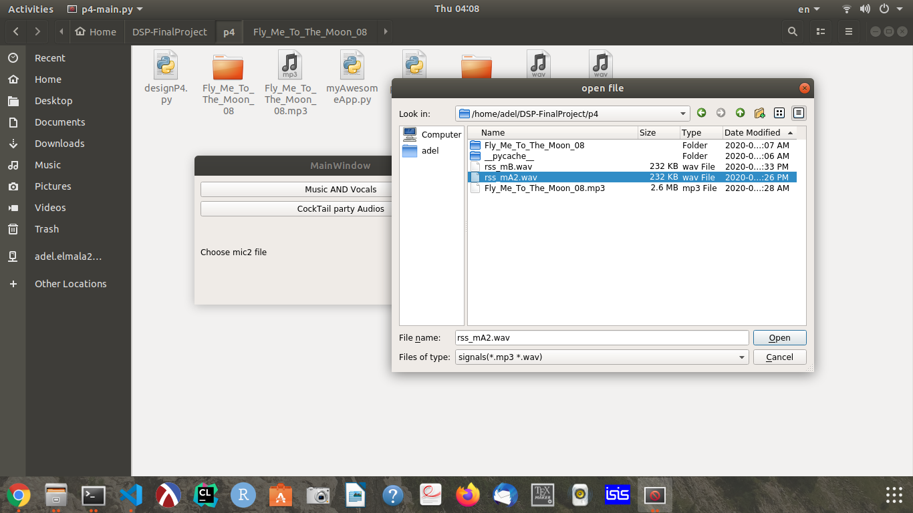
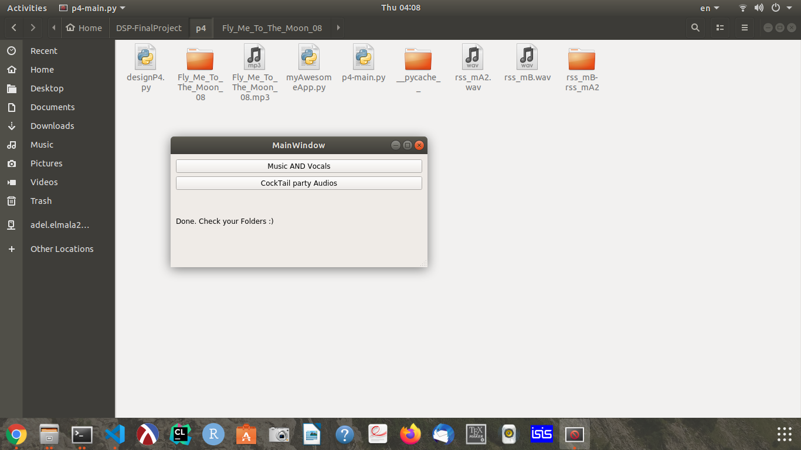

## Problem 4 - Preview

# Vocal and music separation

### Simple GUI Preview

### Selecting song file

### Creating output in a folder named as the input song 

### vocals and music files

# Cocktail party audio files

### Selecting first mic input

### Selecting second mic input

### Creating output folder named the same as the input files (eg. file1-file2)

### Separated files
